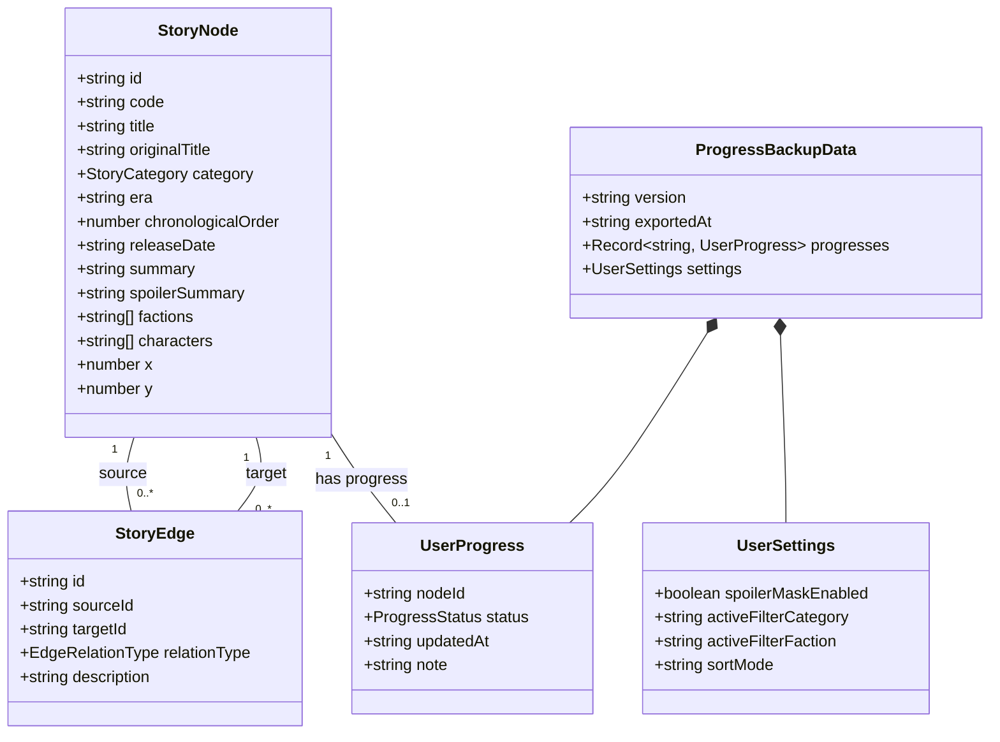

# データモデル設計書: ストーリーのフローチャート (Story Flowchart)

**Feature**: [spec.md](file:///Users/anineko280/work/arknights/specs/001-story-flowchart/spec.md)
**Created**: 2026-08-20

## エンティティ一覧



---

## 1. StoryNode (ストーリーノード)

1つの章、イベントストーリー、オムニバス短編を表す基本データ単位。

| フィールド名 | 型 | 必須 | 説明 | 例 |
| :--- | :--- | :---: | :--- | :--- |
| `id` | `string` | ○ | 一意の識別子（kebab-case） | `"main-00-awakening"` |
| `code` | `string` | ○ | ゲーム内章番号・コード | `"0-1"`, `"EP-01"`, `"OF"` |
| `title` | `string` | ○ | 日本語タイトル | `"暗雲・黎明"` |
| `originalTitle` | `string` | - | 原題 / 英語表記 | `"Evil Time Part 1"` |
| `category` | `StoryCategory` | ○ | 分類（メイン/サイド/幕間/オムニバス） | `"main" \| "intermezzi" \| "side_story" \| "story_collection"` |
| `era` | `string` | ○ | テラ暦年代 / 時系列位置 | `"1096年 冬"` |
| `chronologicalOrder` | `number` | ○ | 時系列ソート用インデックス数値 | `109612` |
| `releaseDate` | `string` | ○ | 公開日 (ISO 8601 YYYY-MM-DD) | `"2020-01-16"` |
| `summary` | `string` | ○ | ネタバレを含まない基礎あらすじ | `"ロドスによるドクター救出作戦が開始される..."` |
| `spoilerSummary` | `string` | - | ネタバレを含む詳細な結末・あらすじ | `"チェルノボグ壊滅とレユニオンの蜂起..."` |
| `factions` | `string[]` | ○ | 関連勢力・国家タグ | `["ロドス", "ウルサス", "レユニオン"]` |
| `characters` | `string[]` | ○ | 主要登場キャラクター | `["アーミヤ", "ドクター", "ケルシー"]` |
| `x` | `number` | ○ | 2Dキャンバス初期配置X座標 | `100` |
| `y` | `number` | ○ | 2Dキャンバス初期配置Y座標 | `200` |

---

## 2. StoryEdge (ストーリー関連線/依存関係)

ノード間の前提関係・派生関係を表す有向エッジ。

| フィールド名 | 型 | 必須 | 説明 | 例 |
| :--- | :--- | :---: | :--- | :--- |
| `id` | `string` | ○ | エッジ一意ID | `"edge-main-00-to-01"` |
| `sourceId` | `string` | ○ | 接続元ノードID (前提ストーリー) | `"main-00-awakening"` |
| `targetId` | `string` | ○ | 接続先ノードID (後続ストーリー) | `"main-01-evil-time"` |
| `relationType` | `EdgeRelationType` | ○ | 関連種別 | `"direct_prerequisite"` (直接の前提)<br>`"chronological_next"` (時系列後続)<br>`"recommended_reading"` (推奨副読)<br>`"spinoff"` (派生・外伝) |
| `description` | `string` | - | 関係の補足説明 | `"第0章クリア直後の物語"` |

---

## 3. UserProgress (ユーザー進行度・読了状況)

各ストーリーノードに対するユーザーごとの読了ステータス。

| フィールド名 | 型 | 必須 | 説明 | 許容値 |
| :--- | :--- | :---: | :--- | :--- |
| `nodeId` | `string` | ○ | 対象ノードID | 既存のStoryNode.id |
| `status` | `ProgressStatus` | ○ | 読了状態 | `"unread"` (未読)<br>`"reading"` (閲覧中)<br>`"completed"` (読了)<br>`"skipped"` (スキップ) |
| `updatedAt` | `string` | ○ | 最終更新日時 (ISO 8601) | `"2026-08-20T12:00:00Z"` |
| `note` | `string` | - | ユーザーメモ | `"第4話まで閲覧"` |

---

## 4. ProgressBackupData (進捗バックアップスキーマ)

JSONエクスポート/インポート用の構造定義。

```json
{
  "$schema": "http://json-schema.org/draft-07/schema#",
  "type": "object",
  "required": ["version", "exportedAt", "progresses", "settings"],
  "properties": {
    "version": { "type": "string", "enum": ["1.0.0"] },
    "exportedAt": { "type": "string", "format": "date-time" },
    "progresses": {
      "type": "object",
      "additionalProperties": {
        "type": "object",
        "required": ["nodeId", "status", "updatedAt"],
        "properties": {
          "nodeId": { "type": "string" },
          "status": { "type": "string", "enum": ["unread", "reading", "completed", "skipped"] },
          "updatedAt": { "type": "string" },
          "note": { "type": "string" }
        }
      }
    },
    "settings": {
      "type": "object",
      "required": ["spoilerMaskEnabled"],
      "properties": {
        "spoilerMaskEnabled": { "type": "boolean" },
        "activeFilterCategory": { "type": "string" },
        "activeFilterFaction": { "type": "string" },
        "sortMode": { "type": "string" }
      }
    }
  }
}
```
